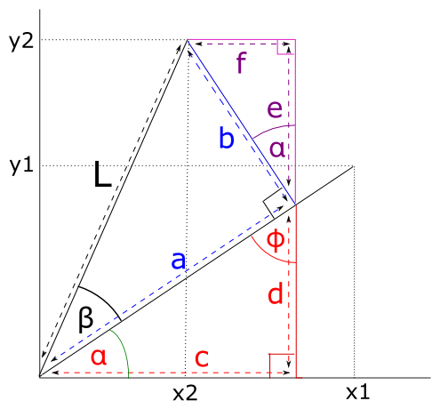

###################################
Formula for rotating a vector in 2D
###################################

Let's say we have a point $(x_1, y_1)$.  The point also defines the vector $(x_1, y_1)$.

We rotate this vector anticlockwise around the origin by $\beta$ degrees.

The rotated vector has coordinates $(x_2, y_2)$.

Can we get the coordintes of $(x_2, y_2)$ given $(x_1, y_1)$ and $\beta$?

$L$ is the length of the vectors $(x_1, y_1)$ and $(x_2, y_2)$ : $L =
\|(x_1, y_1)\| = \|(x_2, y_2)\|$.

$\alpha$ is the angle between the x axis and $(x_1, y_1)$.

We can see from the picture that:

.. math::

    x_2 = c - f

    y_2 = e + d

We are going to use some basic trigonometry to get the lengths of $c, f, e,
d$.

Because the angles in a triangle sum to 180 degrees, $\phi$ on the picture is
$90 - \alpha$ and therefore the angle between lines $b, e$ is also $\alpha$.

Remembering the definitions of $\cos$ and $\sin$:

.. math::

    \cos\theta = \frac{A}{H} \implies A = \cos \theta H

    \sin\theta = \frac{O}{H} \implies O = \sin \theta H

Thus:

.. math::

    x_1 = \cos \alpha L

    y_1 = \sin \alpha L

    a = \cos \beta L

    b = \sin \beta L

    c = \cos \alpha a = \cos \alpha \cos \beta L = \cos \beta x_1

    d = \sin \alpha a = \sin \alpha \cos \beta L = \cos \beta y_1

    e = \cos \alpha b = \cos \alpha \sin \beta L = \sin \beta x_1

    f = \sin \alpha b = \sin \alpha \sin \beta L = \sin \beta y_1

So:

.. math::

    x_2 = c - f = \cos \beta x_1 - \sin \beta y_1

    y_2 = e + d = \sin \beta x_1 + \cos \beta y_1

Luckily this is the same result as `wikipedia on rotation matrices
<https://en.wikipedia.org/wiki/Rotation_matrix>`_.

.. include:: links_names.inc
